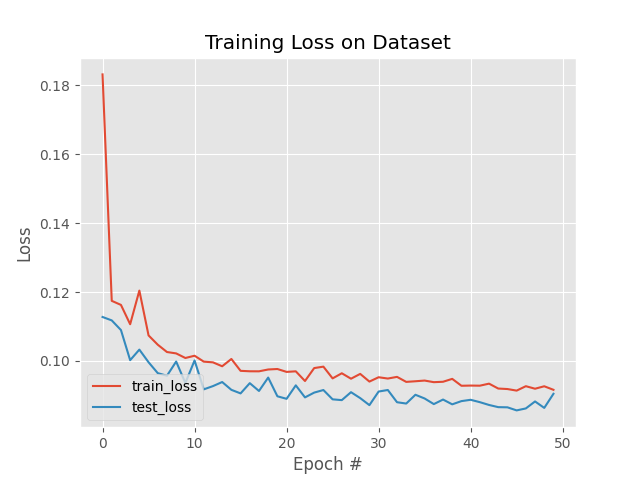
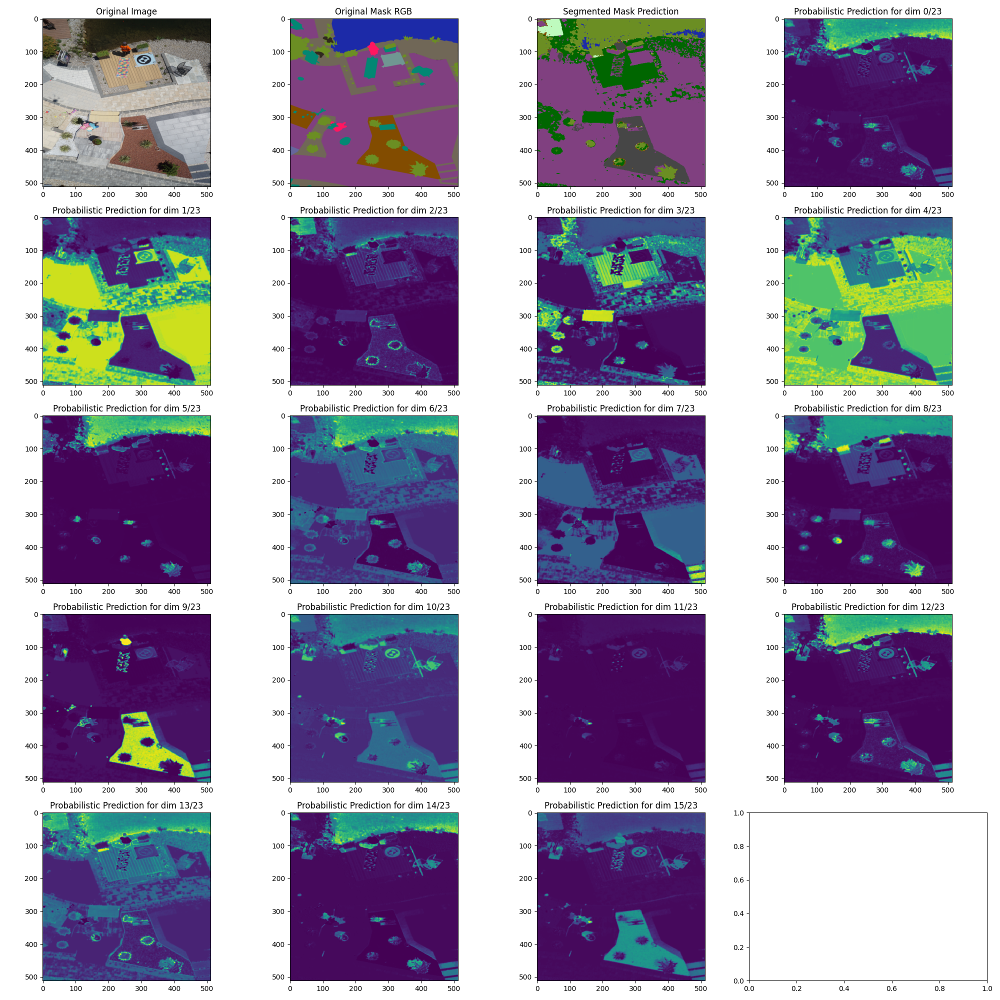
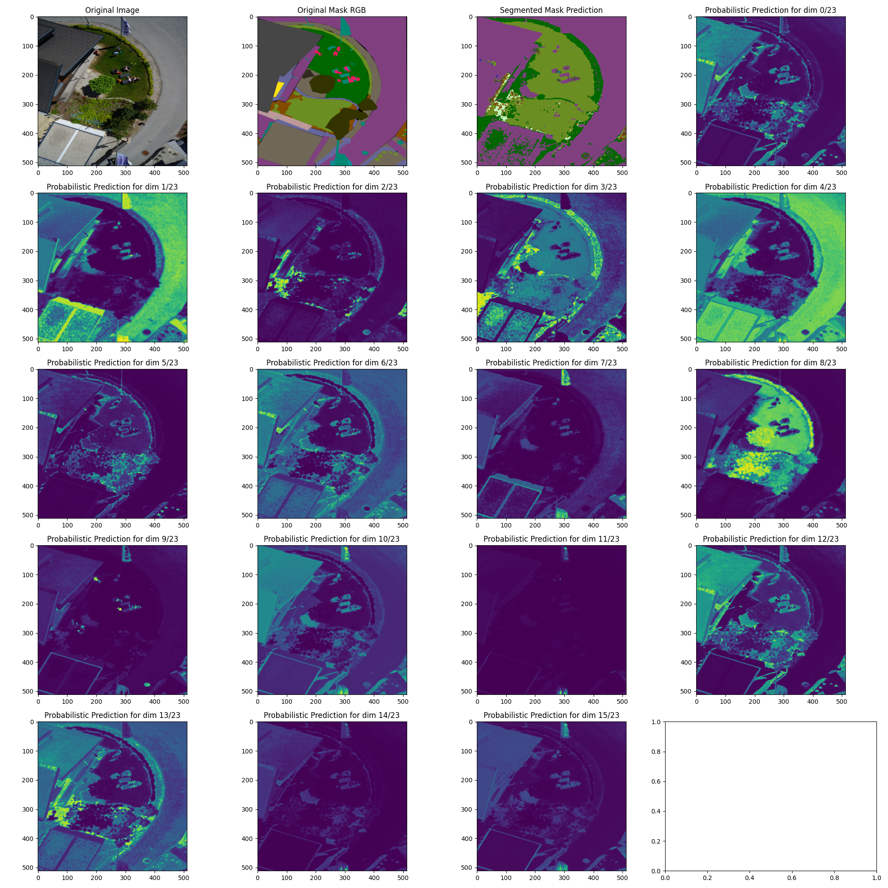

# **Acceleration Material : Semantic Segmentation**


## **Presentation**

The goal of this project was to build a Semantic Segmentation Model on the drone dataset **[(link)](https://www.kaggle.com/datasets/bulentsiyah/semantic-drone-dataset)** by implementing a UNet model.
We used the following link as the basis of our architecture : **[(link)](https://pyimagesearch.com/2021/11/08/u-net-training-image-segmentation-models-in-pytorch/?fbclid=IwAR1N67RjDRDQDR-c7Ih2115m0A2qE7ciVp2aGNzDMZagRdJ-U1ZFFtNFgS0)** and we improved it by implementing classes objects, multiclass classification, metrics, parallelism computation and so on.

*Here is the architecture of a UNet model :*

<br/>

<p align="center">
	
</p>

## How to get started

0. Clone the repository
```bash
git clone https://github.com/Worl0r/Semantic_Segmentation_U-NET.git
```

1. Please organize the *dataset* folder with the following tree :
```bash
|---dataset
      |---semantic_drone_dataset
            |---label_images_semantic
            |---original_images
            |---RGB_color_image_masks
            |---class_dict_seg.csv
```

*Note 1 :* label_images_semantic folder is currently unused.

*Note 2 :* You can download it here: **[(link)](https://www.kaggle.com/datasets/bulentsiyah/semantic-drone-dataset)**

2. Install the libraries dependencies with the *requirements.txt* :
```bash
pip install -r requirements.txt
```

Install the right version of torch :
```bash
pip3 install torch==1.12.1+cu113 torchvision==0.13.1+cu113 torchaudio===0.12.1 -f https://download.pytorch.org/whl/torch_stable.html
```

*Note:* These version are mandatory for the **[Gricad Calculator]( https://gricad.univ-grenoble-alpes.fr/)**. Feel free to adapt these versions to your own environment.

3. Your first step is to train a model. Tune the variables in the *config.py* file (the values displayed here are the ones used for our results) :

### General Settings:

**Define your ID**

* The ID of your process #value: TYPE_PROCESS + "_JJ_MM_YY_part-x" : *ID_SESSION = "train_12_12_23_part-5"*

**Test or Train the model**

* The process you want to perform #value: {"train", "test"} : *TYPE_PROCESS = "train"*

**Activate Parallelism**

* Swicth on/off the computation on multiple gpus : *ACTIVATE_PARALLELISM = True*

* The number of subprocesses to use for data loading : *NBR_WORKERS = 24*

* The number of gpus : *NBR_GPU = 3*

*Note:* On gricad you have to activate Parallelism on testing mode if you trained with parallelism. In that case, NBR_GPU has to be at 1.

### Training Settings:

**Split the dataset**

* The percentage of your dataset that will constitute the test set : *TEST_SPLIT = 0.15*

**Model parameters**

* The channel dimensions of the encoder (note that the first value denotes the number of channels in our input image, and the subsequent numbers gradually double the channel dimension) : *ENC_CHANNELS= (3, 16, 32, 64)*

* The channel dimensions of the decoder (note that the difference here, when compared with the encoder side, is that the channels gradually decrease by a factor of 2 instead of increasing) : *DEC_CHANNELS = (64, 32, 16)*

* The number of classes : *NBR_CLASSES = 24*

* The height of the rescaled images : *INPUT_IMAGE_HEIGHT = 512*

* The width of the rescaled images : *INPUT_IMAGE_WIDTH = 512*

* The batch size : *BATCH_SIZE = 4*

* The number of epochs : *NUM_EPOCHS = 50*

* The learning rate : *INIT_LR = 0.01*

* The type of the threshold to create the segmentation masks from the predictions in case of unlabeled binary classification : *THRESHOLD_TYPE = "mean"*

**Vizualization parameters**

* Switch on/off the vizualisation mode (True if you want to print graphs during the training) : *MODE_VISUALIZATION = False*

* The dimension list of vizualisation (start at 0) : *VISUALIZATION_DIM = 6*

*Note:* This number is also use when you print your plots in the test mode.

**Early Stopping**

* Switch on/off the early stopping to halt the model when the performance on the validation set starts to degrade to avoid overfitting : *EARLY_STOPPING_ACTIVATE = False*

* The number of successive epochs to wait before performing the early stopping if the performance on the validation continues to degrade : *PATIENCE = 5*

*Note:* It is recommended to desactivate this option. In fact, this is a work in progress and the result is not yet known.

### Testing Settings:

* The number of randomly selected images from the testing set used for the validation. This number has to be lower than your test set stored in test_paths.txt : *SELECTED_IMAGE_TEST = 10*

## Useful command lines

0. Connect to GRICAD

```bash
ssh bigfoot.ciment
```

1. Activate virtual environement

```bash
source /applis/environments/conda.sh
source /applis/environments/cuda_env.sh bigfoot  11.2
conda activate torch
```

2. Send your script to GRICAD
```bash
oarsub -S ./GricadScript.sh
```

3. See the status of your script
```bash
oarstat -fj [ID]
```

4. Delete your script execution
```bash
oardel [ID]
```

5. Send files
```bash
rsync -avxH data alchantd@cargo.univ-grenoble-alpes.fr:/bettik/PROJECTS/pr-material-acceleration/alchantd/data
```

6. Bonus
```bash
# List of GPU for Gricad: : -p "gpumodel='A100'"  or -p "gpumodel='V100'"  or -p "gpumodel!='T4'"

#Make executable the script bash:
chmod +x SingleGPUScript.sh

# See the status of your session:
oarstat -u

# Go to interactive mode:
oarsub -l /nodes=1/gpu=1 -p "gpumodel='A100'"  -I --project pr-material-acceleration
```

7. Find the dataset at:
```bash
# replace login by your login.
cd /bettik/PROJECTS/pr-material-acceleration/login/
```
## Results
**1. nbr_classes = 24 Learningrate = 0.01 batch = 4 epoch = 50**
<br/>

<p align="center">
	
      
      
</p>

## Troubleshootings:

* When you start a training with the interactive mode. Make sure to be consistent with your number of GPU. In fact, it is recommended to be on the same interactive mode session to test and train, even if in the test mode you use always one GPU.

## References:

[1] [*U-Net: Training Image Segmentation Models in PyTorch*](https://pyimagesearch.com/2021/11/08/u-net-training-image-segmentation-models-in-pytorch/) For the U-NET architecutre.

[2] [*Semantic Segmentation Drone Dataset (U-Net)*](https://www.kaggle.com/code/nicopaolinelli/semantic-segmentation-drone-dataset-u-net) For the augmented data on our project.
