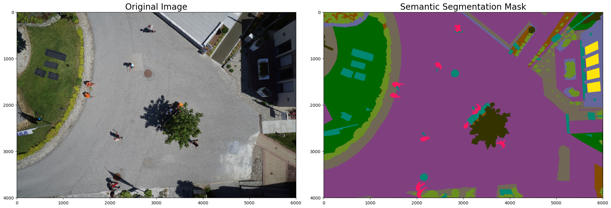
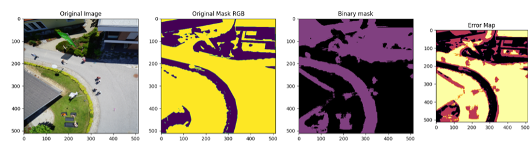
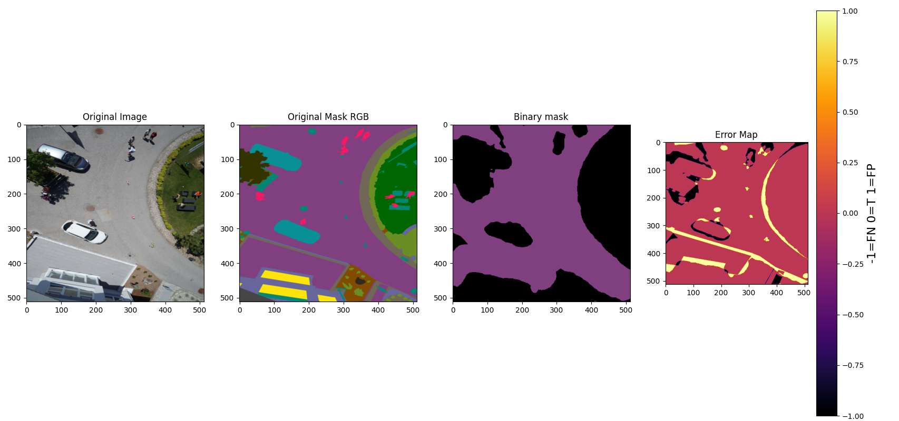
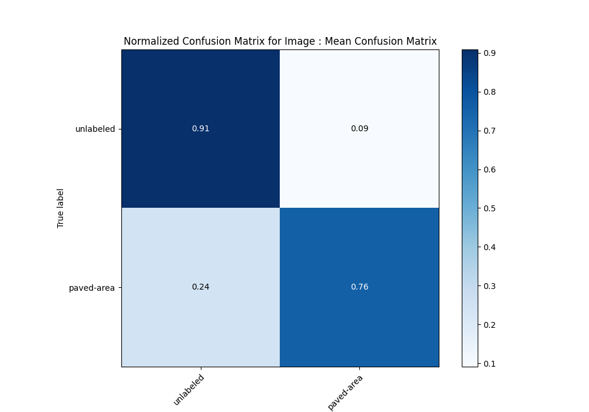
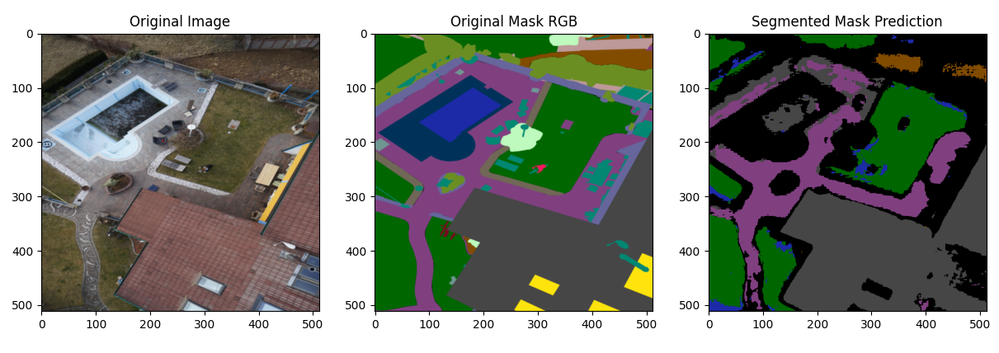
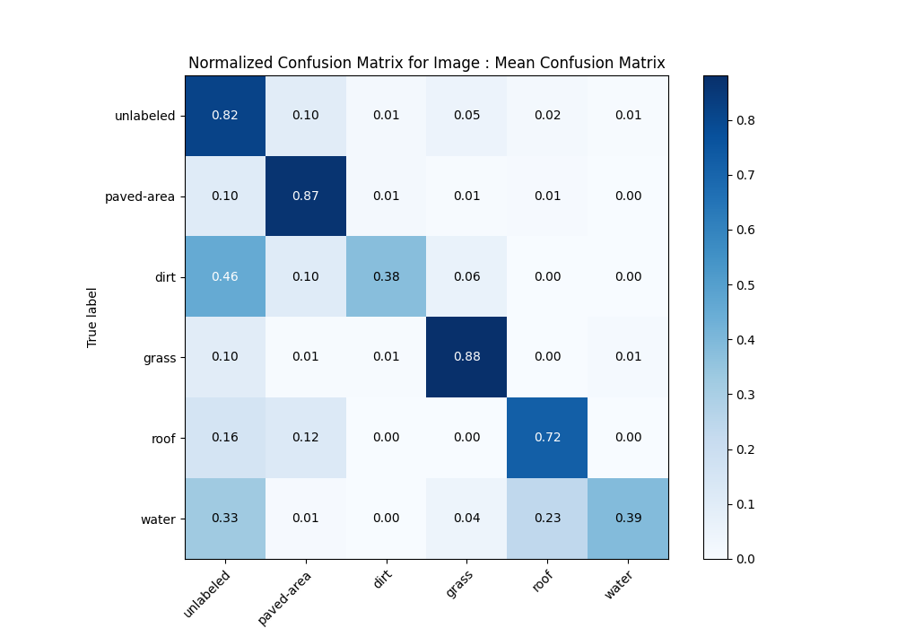
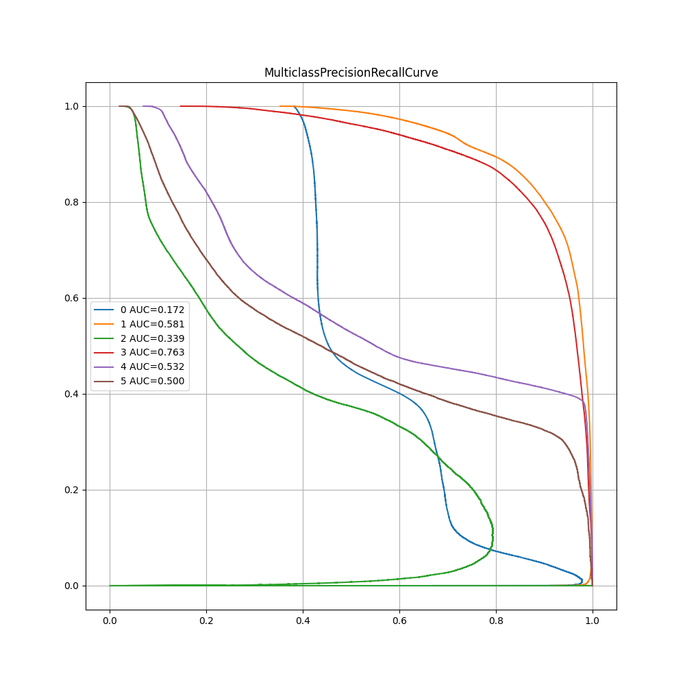
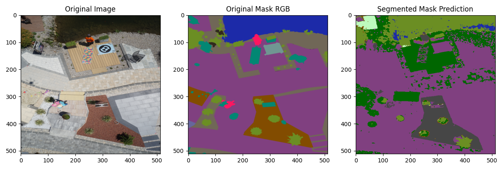
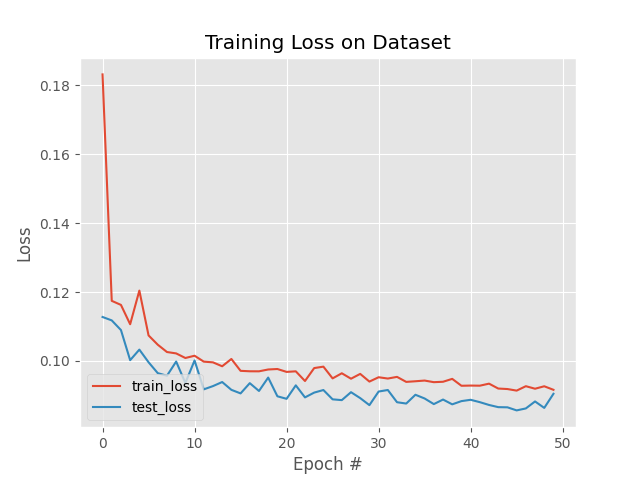
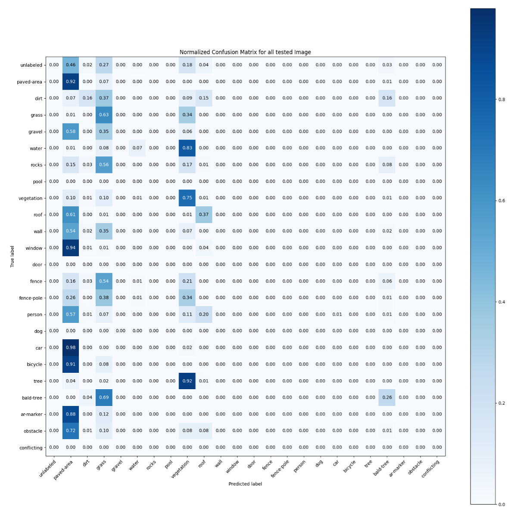

# **Acceleration Material : Multiclass Semantic Segmentation**


## **Presentation**

Semantic segmentation is the task of clustering parts of an image together which belong to the same object class. It is a form of pixel-level prediction because each pixel in an image is classified according to a category. The goal of this project was to build a **Multiclass Semantic Segmentation Model** on the drone dataset: **[*Aerial Drone Images [1]*](https://www.kaggle.com/datasets/bulentsiyah/semantic-drone-dataset)** by implementing a **U-NET** model.
We used the following link as the basis of our architecture : **[*U-Net: Training Image Segmentation Models in PyTorch [2]*](https://pyimagesearch.com/2021/11/08/u-net-training-image-segmentation-models-in-pytorch/?fbclid=IwAR1N67RjDRDQDR-c7Ih2115m0A2qE7ciVp2aGNzDMZagRdJ-U1ZFFtNFgS0)** and we improved it by implementing **classes objects**, **multiclass classification**, **metrics**, **parallelism computation** and also **data augmentation**.

*Here is the architecture of a **U-NET** model :*

<br/>

<p align="center">
	
</p>
<p>&nbsp;</p>

**Do not hesitate to see the report entitled **Acceleration_Material_Project_Brice_Convers** which lives in the document folder to learn more about results and conclusion of the project**.

## Semantic Annotation

* This is an example of what we want to segment semantically :

<p align="center">
	
</p>
<p>&nbsp;</p>


## Results

### Unlabel Binary Segmentation

**1. nbr_classes = 1, Learningrate = 0.001, batch = 16, epoch = 30, id = binaire-0 F1=0.07, dataAugmentation = True**
<p align="center">
	
</p>
<p>&nbsp;</p>

* We simply classify each pixel of our prediction with an average threshold so as to have 50% of each class. The main result of this part is a highlighting of the image contours.

### Semantic Binary Segmentation

**1. nbr_classes = 2, Learningrate = 0.0001, batch = 8, epoch = 25, id = binaire-1-4, dataAugmentation = True**
<p align="center">
	
</p>
<p>&nbsp;</p>

* In this part we try to detect paved-area. We have for our best model : F1=0.75, dice=0.79, roc=0.8 and this following confusion matrix.

<p>&nbsp;</p>
<p align="center">
	
</p>
<p>&nbsp;</p>

### Multiclass Semantic Segmentation with 6 classes

We classify these clases:
<p>&nbsp;</p>
<p align="center">
	
</p>
<p>&nbsp;</p>

**1. nbr_classes = 6, Learningrate = 0.001, batch = 16, epoch = 45, id = multiclass-3, dataAugmentation = True**
<p align="center">
	
</p>

<p>&nbsp;</p>

* We have for this example : F1=0.47, dice=0.47 and this following confusion matrix and precision recall curves.

<p>&nbsp;</p>

<p align="center">
	
</p>

<p align="center">
	
</p>

* you can find more information about it, in the **output** folder.

### Multiclass Semantic Segmentation with 24 classes.

**2. nbr_classes = 24, LearningRate = 0.01, batch = 4, epoch = 50, id = train_12_12_23_part-6**
<br/>

<p align="center">
	
</p>

* We classify each pixel with 24 classes and we obtain a good contouring for our images. However, the semantic is not accurate at all.

<p>&nbsp;</p>

<p align="center">
	
</p>


* We can see from the loss figure that we have succeeded in making our model converge. However, results are very approximate.

<p>&nbsp;</p>

<p align="center">
	
</p>

* This confusion matrix is a really good metric to see that we really detect just few classes (just 3 above 63%). And during the test we have a F1 metric of 0.953.

## How to get started

0. Clone the repository
```bash
git clone https://github.com/Worl0r/Semantic_Segmentation_U-NET.git
```

1. Please organize the *dataset* folder with the following tree :
```bash
|---dataset
      |---semantic_drone_dataset
            |---label_images_semantic
            |---original_images
            |---RGB_color_image_masks
            |---class_dict_seg.csv
```

*Note 1 :* label_images_semantic folder is currently unused.

*Note 2 :* You can download it here: **[*Aerial Semantic Segmentation Drone Dataset*](https://www.kaggle.com/datasets/bulentsiyah/semantic-drone-dataset)**

2. Install the libraries dependencies with the *requirements.txt* :

* Setup your virtual environement in your working directory
```bash
# Create your virtual environement
python -m venv [name]

# Active your virtual environement (MacOS)
source [name]/bin/activate
```

* Install dependencies
```bash
pip install -r requirements.txt
```

* Install the right version of torch :
```bash
pip3 install torch==1.12.1+cu113 torchmetrics==1.2.1 torchvision==0.13.1+cu113 torchaudio==0.12.1 -f https://download.pytorch.org/whl/torch_stable.html
```

*Note:* These version are mandatory for the **[Gricad Calculator]( https://gricad.univ-grenoble-alpes.fr/)**. Feel free to adapt these versions to your own environment.

3. Your first step is to train a model. Tune the variables in the *config.py* file (the values displayed here are the ones used for our results) :

### General Settings:

**Define your ID**

* The ID of your process #value: TYPE_PROCESS + "_JJ_MM_YY_part-x" : *ID_SESSION = "train_12_12_23_part-5"*

**Test or Train the model**

* The process you want to perform #value: {"train", "test"} : *TYPE_PROCESS = "train"*

**Activate Parallelism**

* Swicth on/off the computation on multiple gpus : *ACTIVATE_PARALLELISM = True*

* The number of subprocesses to use for data loading : *NBR_WORKERS = 24*

* The number of gpus : *NBR_GPU = 4*

*Note:* On gricad you have to activate Parallelism on testing mode if you trained with parallelism. In that case, NBR_GPU has to be at 1.

* CUDA_VISIBLE_DEVICES : Name your devices according the number of GPUs.

**Augmented Data**

* if you want to use augmented data (from 400 to 1600), you need first to activate : AUG_DATA = True and GENERATE_AUGMENTED_DATA = True.
Then start once (two if there is a bug during the folder creation) the script called **augmentedData.py**.
Finally, deactivate GENERATE_AUGMENTED_DATA = False for safty and continue as usual.

*Note:* Make sur you have enough space, the dataset is heavy (about 5Go).

### Training Settings:

**Split the dataset**

* The percentage of your dataset that will constitute the test set : *TEST_SPLIT = 0.15*

**Model parameters**

* The channel dimensions of the encoder (note that the first value denotes the number of channels in our input image, and the subsequent numbers gradually double the channel dimension) : *ENC_CHANNELS= (3, 16, 32, 64)*

* The channel dimensions of the decoder (note that the difference here, when compared with the encoder side, is that the channels gradually decrease by a factor of 2 instead of increasing) : *DEC_CHANNELS = (64, 32, 16)*

* The number of classes : *NBR_CLASSES = 24*

* The height of the rescaled images : *INPUT_IMAGE_HEIGHT = 512*

* The width of the rescaled images : *INPUT_IMAGE_WIDTH = 512*

* The batch size : *BATCH_SIZE = 4*

* The number of epochs : *NUM_EPOCHS = 50*

* The learning rate : *INIT_LR = 0.01*

* The type of the threshold to create the segmentation masks from the predictions in case of unlabeled binary classification : *THRESHOLD_TYPE = "mean"*

**Vizualization parameters**

* Switch on/off the vizualisation mode (True if you want to print graphs during the training) : *MODE_VISUALIZATION = False*

*Note:* This option is obsolete and it is not really relevant to activate it.

* The dimension list of vizualisation (start at 0) : *VISUALIZATION_DIM = 6*

*Note:* This number is also use when you print your plots in the test mode.

**Early Stopping**

* Switch on/off the early stopping to halt the model when the performance on the validation set starts to degrade to avoid overfitting : *EARLY_STOPPING_ACTIVATE = False*

* The number of successive epochs to wait before performing the early stopping if the performance on the validation continues to degrade : *PATIENCE = 5*

*Note:* It is recommended to desactivate this option. In fact, this is a work in progress and the result is not yet known.

**Data augmentation**

* Switch on/off the generation of the augmented data : *GENERATE_AUGMENTED_DATA = False*

* The data has been augmented : *AUG_DATA = True*

*Note* : To use augmented data, you need to launch the *augmentedData.py* script first to create the new data and then activate  *GENERATE_AUGMENTED_DATA = True*


### Testing Settings:

* The number of randomly selected images from the testing set used for the validation. This number has to be lower than your test set stored in test_paths.txt : *SELECTED_IMAGE_TEST = 10*

* You can choose to plot all confusion matrix for all tested images with : ALL_METRICS = False

*Note:* We recommend that you leave False, as the average confusion matrix will be printed in all cases.

## Output

1. Once you've trained and tested your model, it is saved in a new folder called *train_ID_SESSION* in the *output* folder with the following tree :

```bash
|--- output
	|--- train_ID_SESSION
		|--- metrics_plots/
		|--- test_plots/
		|--- train_plots/
		|--- ConfusionMatrix_Normalized.png
		|--- ConfusionMatrix.png
		|--- Mean_Average_Precision_For_All_Images.png
		|--- Metrics.txt
		|--- PrecisionRecallCurve_For_All_Images.png
		|--- ROC_For_All_Images.png
		|--- Save_config_ID_train_ID_session.txt
		|--- SaveOutputAndErrorbinaire-1-4.txt
		|--- test_paths.txt
		|--- TrainingMetrics.png
		|--- TrainingMetrics.txt
		|--- unet_tgs_paths.pth
```

* The folder *metrics_plot* contains the plots of the metrics from the testing process.

* The folder *test_plots* contains the predictions from the testing process.

* The folder *train_plots* contains the plots of the training model samples for the first image of each batch.

* The *ConfusionMatrix_Normalized.png* file contains the normalized mean confusion matrix calculated through all images tested.

* The *ConfusionMatrix.png* file contains the confusion matrix calculated through all  the images tested.

* The *Metrics.txt* sums up some metrics during the test.

* The *PrecisionRecallCurve_For_All_Images, ROC_For_All_Images,Mean_Average_Precision_For_All_Images* files represent various metric figures computed through all images.

* *Save_config_ID_train_ID_session.txt* is the *config.py* with the parameters you defined during the training.

* *SaveOutputAndErrorbinaire-1-4.txt* is available only on Gricad and represents all logs during the training and the test.

* *test_paths.txt* is the paths of your test images.

* *TrainingMetrics.png* contains metrics during training process (Loss function, Dice coefficient and learning rate).

* *TrainingMetrics.txt* indicates the training time.

* *unet_tgs_paths_salt.pth* is the output serialized model path

**More conclusions and interpretations of the results can be found in the report entitled **Acceleration_Material_Project_Brice_Convers** which lives in the document folder**.

## Useful command lines

0. Connect to GRICAD

```bash
ssh bigfoot.ciment
```

1. Activate virtual environement

```bash
source /applis/environments/conda.sh
source /applis/environments/cuda_env.sh bigfoot  11.2
conda activate torch
```

2. Send your script to GRICAD
```bash
oarsub -S ./GricadScript.sh
```

3. See the status of your script
```bash
oarstat -fj [ID]
```

4. Delete your script execution
```bash
oardel [ID]
```

5. Send files
```bash
rsync -avxH data alchantd@cargo.univ-grenoble-alpes.fr:/bettik/PROJECTS/pr-material-acceleration/alchantd/data
```

6. Bonus
```bash
# List of GPU for Gricad: : -p "gpumodel='A100'"  or -p "gpumodel='V100'"  or -p "gpumodel!='T4'"

#Make executable the script bash:
chmod +x SingleGPUScript.sh

# See the status of your session:
oarstat -u

# Go to interactive mode:
oarsub -l /nodes=1/gpu=1 -p "gpumodel='A100'"  -I --project pr-material-acceleration
```

7. Find the dataset at:
```bash
# replace login by your login.
cd /bettik/PROJECTS/pr-material-acceleration/login/
```

## Troubleshootings:

* When you start a training with the interactive mode. Make sure to be consistent with your number of GPU. In fact, it is recommended to be on the same interactive mode session to test and train, even if in the test mode you use always one GPU.

* When you run the **augmentedData.py** script, if it's your first time, you may have a problem with the generation of new folders. In this case, run the script again and everything will be fine.

## Futur Plans:

- [ ] Fix some TODO part in the code
- [ ] Try L2 regularisation or dropout

## References:

[1] [*Aerial Semantic Segmentation Drone Dataset:*](https://www.kaggle.com/datasets/bulentsiyah/semantic-drone-dataset) For the dataset.

[2] [*U-Net: Training Image Segmentation Models in PyTorch :*](https://pyimagesearch.com/2021/11/08/u-net-training-image-segmentation-models-in-pytorch/) For the U-NET architecutre.

[3] [*Semantic Segmentation Drone Dataset (U-Net) :*](https://www.kaggle.com/code/nicopaolinelli/semantic-segmentation-drone-dataset-u-net) For the augmented data on our project.

[4] [*Lecture's Dawood Al Chanti :*](https://scholar.google.fr/citations?user=osXo54QAAAAJ&hl=en) *Computer Vision :* TD-3: Bag of Visual Words for Scene Recognition used for the confusion matrix.

[5] [*Multiclass Semantic Segmentation of Aerial Drone Images Using Deep Learning :*](https://github.com/ayushdabra/drone-images-semantic-segmentation) For the augmented data on our project.

## Authors
- [Brice Convers](https://briceconvers.com)
- [Jeanne Lemoine]()
